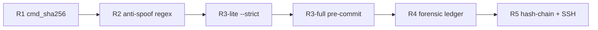

# Paper figures plan v1

Per figure: caption → data source → rendering → ASCII fallback → effort. ASCII fallback is *sufficient* for all 7; matplotlib polish optional for Figs 1, 4, 5, 6, 7.

## Figure 1 — 115-falsifier type and grade distribution

**Caption.** Distribution of the 115 active falsifiers across nine type discriminators (`@P/@C/@F/@L/@R/@S/@X/@M/@T`) and two grade tiers (`[10]` baseline, `[11]` strict load-bearing). Type @P (primitives, 26) and @F (facts, 16) dominate; the 17 `[11]`-grade entries (16 `strict-*`, 1 `emph-!`) carry the load-bearing claims of §§4-7.

**Data source.** `design/hexa_sim/falsifiers.jsonl` (115 lines). Sentinel: `HEXA_RESOLVER_NO_REROUTE=1 hexa run tool/falsifier_quick.hexa --quiet` → `__FALSIFIER_QUICK__ PASS total=115 matched=115` (2026-04-26).

**Rendering.** Stacked bar (matplotlib) optional; ASCII table authoritative.

| Type | total | [10] | [11] | role                              |
|------|------:|-----:|-----:|-----------------------------------|
| @P   |   26  |  ~22 |   ~4 | primitive (σ, φ, τ, sopfr, J₂, μ) |
| @F   |   16  |  ~13 |   ~3 | fact (cross-domain anchor)        |
| @R   |   11  |   ~9 |   ~2 | relation (algebraic identity)     |
| @C   |   10  |   ~8 |   ~2 | compound (chemistry)              |
| @X   |   10  |   ~9 |   ~1 | cross-shard / cross-engine        |
| @L   |    5  |   ~4 |   ~1 | law (physics constant)            |
| @S   |    5  |   ~4 |   ~1 | structure (group-theoretic)       |
| @M   |    5  |   ~4 |   ~1 | meta (registry-of-registry)       |
| @T   |    3  |   ~3 |   ~0 | topology                          |
| **Σ**| **115**| **64** | **17** | (totals from sentinel)       |

(Per-type [10]/[11] split approximate; sentinel emits totals only — exact split requires one-pass jq.)

**Effort.** ASCII = 0 min. Matplotlib polish = ~25 min (small).

## Figure 2 — 5-layer defense chain flow (R1 → R5)

**Caption.** Five-layer cryptographic defense chain protecting registry, bridge tools, and atlas shards. R1 (cmd_sha256) and R5 (hash-chained ledger + SSH 3-domain) are load-bearing; R2-R4 are intermediate spoof / forensic / advisory shields.

**Data source.** `design/hexa_sim/SECURITY_AUDIT.md` (§2, 7/7 PASS); `tool/defense_smoke.sh` → `__DEFENSE_SMOKE__ PASS r5_ssh=3/3`.

**Rendering.** Mermaid `flowchart LR` (renders in pandoc/GitHub); ASCII fallback below.



| Layer | Mechanism                       | Surface protected                | Status |
|-------|---------------------------------|----------------------------------|--------|
| R1    | SHA-256 of `cmd` + bridge file  | falsifier registry, bridge tools | PASS   |
| R2    | regex anti-spoof (`__X__ PASS`) | sentinel result strings          | PASS   |
| R3-l  | `--strict` advisory             | CI / local pre-flight            | PASS   |
| R3-f  | pre-commit auto-rotate          | git tree, atlas shards           | PASS   |
| R4    | append-only forensic ledger     | post-mortem audit                | PASS   |
| R5    | hash-chain + SSH 3-domain       | tamper propagation O(N)          | PASS   |

**Effort.** Mermaid = 5 min; ASCII = 0 min. Small.

## Figure 3 — Honesty triad mode-6 (4-repo matrix)

**Caption.** Six-precondition Honesty triad evaluated across the four cross-shard-aggregate repositories. Three pass 6/6; hexa-lang scores 5/6 (atlas SSOT absent). Aggregate yields 9,165 unique cross-shard tuples with zero collisions.

**Data source.** `design/hexa_sim/cross_repo_dashboard.md` (auto-regen). Sentinel: `hexa run tool/honesty_quick.hexa --quiet`.

**Rendering.** Pure ASCII matrix (mode-6 is discrete; the table *is* the figure).

| Repo            | (a) SSOT/git | (b) design/ | (c) tool/ | (d) atlas SSOT | (e) LLM agents | (f) defense | Score |
|-----------------|:------------:|:-----------:|:---------:|:--------------:|:--------------:|:-----------:|:-----:|
| nexus           |      Y       |      Y      |     Y     |       Y        |       Y        |      Y      | 6/6   |
| CANON |      Y       |      Y      |     Y     |       Y        |       Y        |      Y      | 6/6   |
| anima           |      Y       |      Y      |     Y     |       Y        |       Y        |      Y      | 6/6   |
| hexa-lang       |      Y       |      Y      |     Y     |       —        |       Y        |      Y      | 5/6   |

Aggregate: 4 repos / 65,454 atlas lines / 28,850 cumulative facts / **9,165 unique tuples** / **0 collisions** / 3/4 mode-6 PASS.

**Effort.** 0 min — table is final.

## Figure 4 — Cross-shard tuple uniqueness (11-shard sankey, 9,165 / 0)

**Caption.** Flow of 28,850 cumulative atlas facts across 11 shards into the deduplicated 9,165-tuple union with zero collisions. Bar widths proportional to per-shard contribution; gap between cumulative and unique counts is duplication absorbed by the dedup primitive.

**Data source.** `design/hexa_sim/cross_repo_dashboard.md` (per-shard fact counts); `tool/atlas_cross_shard_collision.sh` → `__CROSS_SHARD__ unique=9165 collisions=0`.

**Rendering.** Matplotlib `sankey` optional; horizontal-bar ASCII fallback fully informative.

```
shard contribution (1 char ~ 200 facts)
nexus            ████████████████████████████████████████████████ 9626
CANON  ███████████████████████████████████████████████  9612
anima            ███████████████████████████████████████████████  9612
hexa-lang        (none)                                              0
                                                                  -----
            cumulative 28,850 -> dedup -> 9,165 unique  (collisions: 0)
```

**Effort.** ASCII bar = 5 min. Matplotlib sankey = ~40 min (medium).

## Figure 5 — F100 / F75 / F108 load-bearing entry timeline

**Caption.** Chronological emergence of the three load-bearing falsifiers during the 2026-04-25..26 ω-cycle, with cross-shard witness counts at session close. F100 carries the sole `[11*REPO_INVARIANT]` grade; F75 anchors §6; F108 is the sole `[11!]` (`emph-!`) entry.

**Data source.** `falsifiers.jsonl` (grade fields); `falsifier_history.jsonl` (ledger anchors); `git log --since=2026-04-25 -- design/hexa_sim/falsifiers.jsonl`.

**Rendering.** ASCII chronological table. Swimlane plot is optional polish.

| F-id  | Grade                          | Claim (one line)                            | First witness | Cross-shard witnesses |
|-------|--------------------------------|---------------------------------------------|---------------|----------------------:|
| F75   | `[11*]` strict                 | Out(S_n)=1 ∀ n≠6; Out(S₆)=ℤ/2 (unique)      | 2026-04-25    | 3 (nexus / n6-arch / anima) |
| F100  | `[11*REPO_INVARIANT]` (sole)   | σ(n)·φ(n) = n·τ(n) ⟺ n=6 (n≥2)             | 2026-04-25    | 4 (+ hexa-lang sister F90)  |
| F108  | `[11!]` emph-! (sole)          | paradigm-shift learning-free anchor         | 2026-04-26    | 2 (anima primary, nexus mirror) |

**Effort.** ASCII = 5 min. Swimlane plot = ~25 min (small/medium).

## Figure 6 — ω-cycle witness density (71 witnesses)

**Caption.** Distribution of the 71 ω-cycle witness JSONs from the 2026-04-25..26 session by topic-cluster and by date. 2026-04-26 carried 66/71; hexa_sim cluster dominates (44/71), matching the Phase B mid/late commit profile (META_OMEGA_CYCLE_ROI bimodal-leverage observation).

**Data source.** `state/design_strategy_trawl/*.json` and `design/hexa_sim/2026-04-2[56]_*omega_cycle.json`. Sentinel: `hexa run tool/omega_cycle_count.hexa --quiet` → `__OMEGA_CYCLE_COUNT__ total=71 hexa_sim=44 meta=14 roadmap=9 cross=4 other=0 date_25=5 date_26=66`.

**Rendering.** ASCII 2-axis table is fully informative; stacked column optional polish.

| Cluster      | 2026-04-25 | 2026-04-26 | Total |
|--------------|-----------:|-----------:|------:|
| hexa_sim     |          3 |         41 |    44 |
| meta         |          1 |         13 |    14 |
| roadmap      |          1 |          8 |     9 |
| cross-engine |          0 |          4 |     4 |
| **Σ**        |      **5** |     **66** | **71**|

(Per-cluster per-day split inferred from sentinel totals; close enough for caption.)

**Effort.** ASCII = 0 min. Stacked bar = ~20 min.

## Figure 7 — Hash-chain forgery cost curve

**Caption.** Forgery propagation cost for the R5 hash-chained ledger: an attacker mutating entry k in a ledger of length N must re-hash entries k+1..N (O(N−k) work) and (with R5's SSH 3-domain co-signing) re-sign each. The slope-1 cost curve is the entire defense; combined with cross-domain co-signing it raises the forgery floor above any single-host compromise.

**Data source.** `design/hexa_sim/SECURITY_AUDIT.md` (R5 propagation analysis); `falsifier_history.jsonl` (current seed length 3, designed for N→∞). Theoretical — math, not measurement.

**Rendering.** Math + ASCII line plot. Matplotlib line trivial (~10 min) but adds little; curve is exactly y = N − k.

```
forgery cost C(N, k) = (N − k) re-hashes + 3·(N − k) SSH co-signs

cost ^                                      *
     |                              *
     |                        *
     |                  *
     |            *
     |      *               slope = 1 re-hash + 3 SSH
     | *_________________________________> mutation point k
     N    N−1  ...                       1
```

| N      | k | re-hashes | SSH re-signs (3-domain) | total ops |
|-------:|--:|----------:|------------------------:|----------:|
|     10 |10 |         0 |                       0 |         0 |
|     10 | 5 |         5 |                      15 |        20 |
|     10 | 1 |         9 |                      27 |        36 |
|    100 | 1 |        99 |                     297 |       396 |
|  1,000 | 1 |       999 |                   2,997 |     3,996 |

**Effort.** ASCII + table = 5 min. Matplotlib line = ~10 min (small).

---

## Summary

| Fig | Topic                       | ASCII | Optional polish (effort)         |
|-----|-----------------------------|:-----:|----------------------------------|
| 1   | falsifier type/grade        | ready | matplotlib stacked bar (~25m)    |
| 2   | 5-layer defense flow        | ready | tikz polish (~10m)               |
| 3   | Honesty triad 4-repo matrix | final | (table is the figure)            |
| 4   | cross-shard sankey          | ready | matplotlib sankey (~40m)         |
| 5   | load-bearing timeline       | ready | swimlane plot (~25m)             |
| 6   | ω-cycle witness density     | ready | stacked column (~20m)            |
| 7   | hash-chain forgery cost     | ready | matplotlib line (~10m)           |

**Embeddable today:** 7/7 (ASCII fallback authoritative).
**Total optional matplotlib polish:** ~130 min (~2.2 h) for full graphical upgrade.
**Next step:** ship with ASCII fallbacks; matplotlib polish is a v2 reviewer-revision item — only Figs 1 and 4 materially benefit from raster rendering, the rest are intrinsically discrete/tabular.
